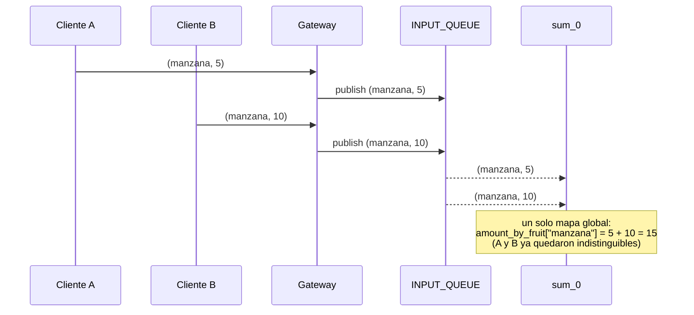
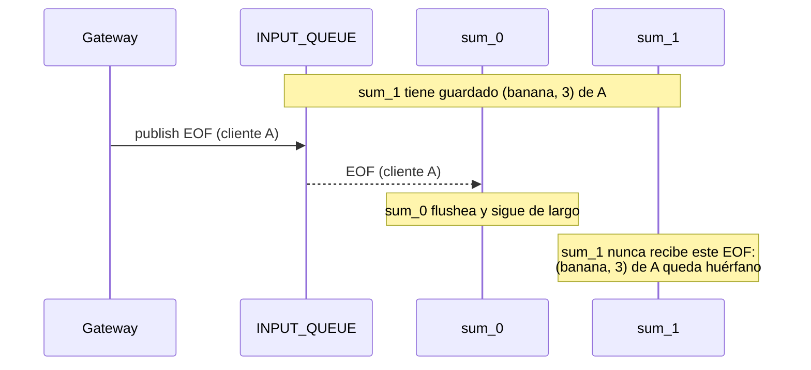
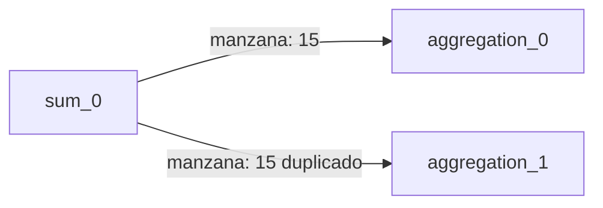
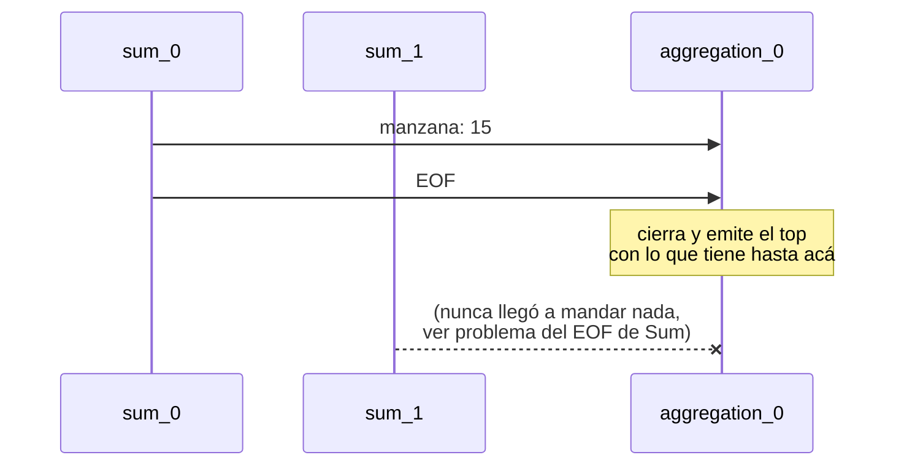
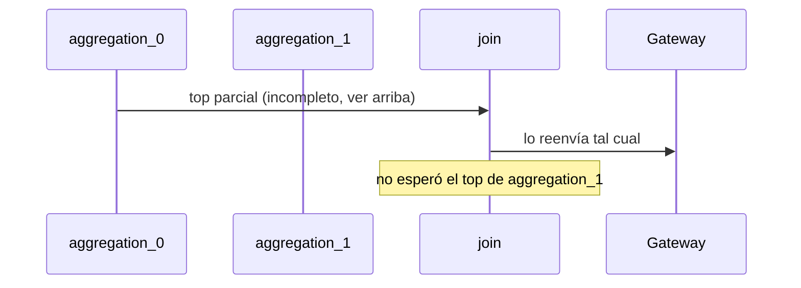
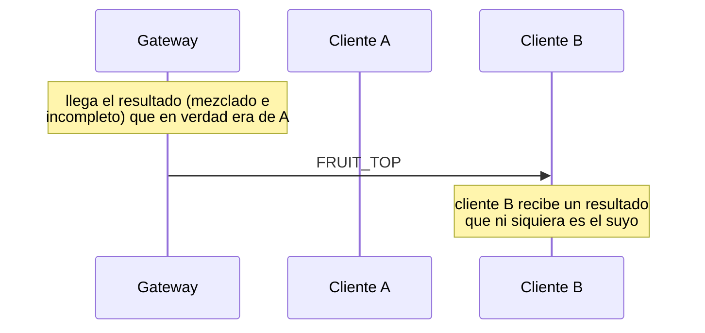

# Informe — TP Coordinación

## Punto de partida

Tras la lectura de la consigna y la revisión del código base, se identificaron una serie de problemas de coordinación. Para que queden trazables de punta a punta se los recorre con un mismo ejemplo guía, con dos clientes concurrentes y dos réplicas de cada control:

- **Cliente A** envía `(manzana, 5)`, `(banana, 3)` y luego EOF.
- **Cliente B** envía `(manzana, 10)`, `(pera, 7)` y luego EOF.
- `SUM_AMOUNT=2` (`sum_0`, `sum_1`) y `AGGREGATION_AMOUNT=2` (`aggregation_0`, `aggregation_1`).

### Middleware sin implementar

`common/middleware/middleware_rabbitmq.py` tenía ambos constructores vacíos (`pass`). No había transporte real entre procesos, así que ninguno de los pasos del ejemplo guía llegaba siquiera a ejecutarse: el sistema no levantaba.

**Solución:** se implementaron ambas clases sobre `pika.BlockingConnection`, con dos formas de comunicación distintas según lo que necesita cada salto de la tubería:

- `MessageMiddlewareQueueRabbitMQ`: una cola durable de trabajo, con consumidores en competencia (round-robin), queremos repartir carga entre réplicas, los datos de `gateway` hacia `sum`.
- `MessageMiddlewareExchangeRabbitMQ`: un exchange de RabbitMQ que se comporta de dos maneras según si se le pasan o no *routing keys*:
  - **Con keys** (tipo `direct`): cada instancia se bindea a su propia clave (p. ej. `aggregation_0`), lo que habilita mandarle un mensaje a una única instancia puntual en vez de a todas.
  - **Sin keys** (tipo `fanout`): cada instancia que se conecta arma su propia cola anónima y exclusiva bindeada al exchange, así que todas reciben una copia de lo publicado sin que el publisher necesite saber cuántas son, esta es la base para resolver "El EOF de un cliente no llegaba a todas las réplicas de Sum", justamente porque el `gateway` no tiene forma de conocer `SUM_AMOUNT`.

Esto se validó contra el escenario 1 (`make switch` → 1 → `make test`): un cliente, una sola réplica de cada control, el transporte funciona de punta a punta.

### Sin aislamiento por cliente

El protocolo interno serializaba únicamente `(fruta, cantidad)`, sin ningún identificador de cliente. `sum`, `aggregation` y `join` acumulan en una única estructura de estado global (`amount_by_fruit`, `fruit_top`), compartida por todas las conexiones activas.

**Solución:** pendiente — incremento 2 (envelope con `client_id`).

### El EOF de un cliente no llegaba a todas las réplicas de Sum

El `gateway` publicaba el aviso de fin de ingesta en la misma cola de trabajo (`INPUT_QUEUE`) que los datos. Como `sum_0` y `sum_1` son consumidores en competencia de esa cola, ese único mensaje lo recibía sólo uno de los dos; el otro nunca se enteraba de que el cliente había terminado y lo que tenga acumulado para ese cliente no se llegaba a enviar. La constante `SUM_CONTROL_EXCHANGE`, declarada pero no usada en `sum/main.py`, era indicio de que el esqueleto anticipaba un canal de control separado para esto.

**Solución:** pendiente — incremento 3 (fan-out del EOF Gateway→Sum sobre el exchange `fanout` ya implementado).

### Sin partición de datos entre réplicas de Aggregation

En `sum/main.py`, `_process_eof` reenviaba cada fruta a **todas** las instancias de Aggregation (loop anidado sobre `data_output_exchanges`), en lugar de a una sola. Esto multiplicaba por `AGGREGATION_AMOUNT` tanto el tráfico entre controles como el cómputo, porque cada Aggregation vuelvía a sumar y ordenar datos que ya había procesado la otra, violando el requisito de minimizar redundancia.

**Solución:** pendiente — incremento 3 (particionado por hash de fruta sobre el exchange `direct` ya implementado).

### Sin barrera de fin de ingesta en Aggregation

`aggregation/main.py` calculaba y emitía su top parcial apenas recibía el primer mensaje de EOF, sin contar que, con `SUM_AMOUNT` instancias de Sum enviándole datos, tendría que haber recibido un EOF de cada una antes de saber que ya tiene el total definitivo de sus frutas.

**Solución:** pendiente — incremento 3 (contador de `SUM_AMOUNT` EOFs recibidos antes de cerrar el top parcial).

### Sin combinación real en Join

`join/main.py` era un *passthrough*: reenviaba cada mensaje recibido tal cual, sin esperar los `AGGREGATION_AMOUNT` EOFs de las instancias de Aggregation ni combinar sus tops parciales en un top final.

**Solución:** pendiente — incremento 4 (contador de `AGGREGATION_AMOUNT` EOFs + merge de los tops parciales en uno final).

### El gateway no podía enrutar resultados a su cliente de origen

`message_handler.py` no tenía ninguna noción de a qué cliente pertenecía un mensaje de resultado; simplemente lo ofrecía al primer cliente conectado que no descartara el mensaje.

**Solución:** pendiente — incremento 2 (matching de `client_id` en `message_handler.py`).

### Sin manejo de señales en los controles internos

`sum`, `aggregation` y `join` no capturaban SIGTERM (sólo lo hacían `client` y `gateway`). Si en medio de esta corrida se ejecutaba `make down`, `sum_1` —que todavía tenía `(banana, 3)` de A sin flushear— era terminado abruptamente al vencer el plazo de gracia, sin poder cerrar la conexión al middleware de forma ordenada.

**Solución:** pendiente — incremento 5 (manejo de SIGTERM en Sum, Aggregation y Join, análogo al que ya usan `client` y `gateway`).

