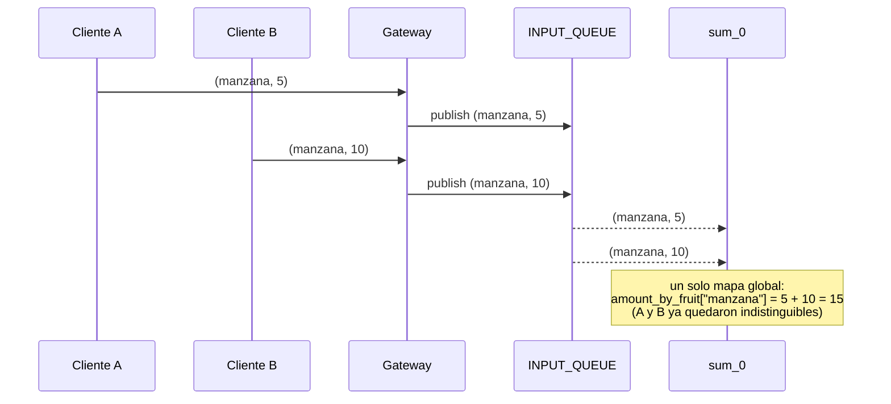
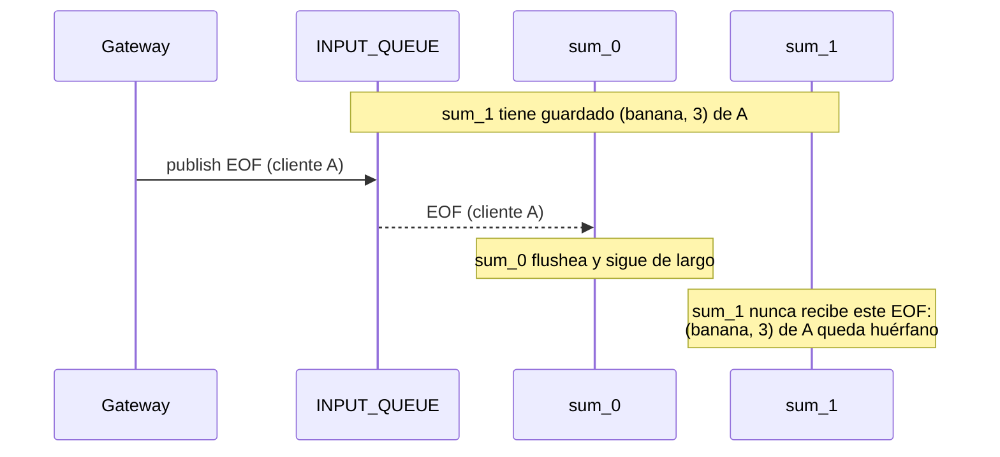
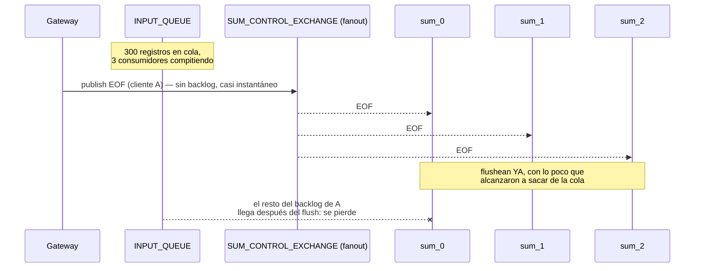
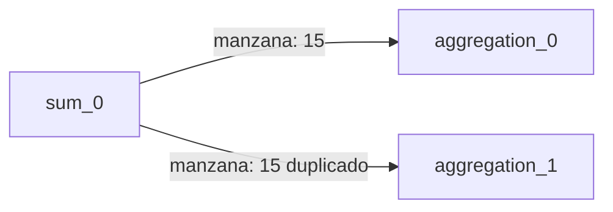
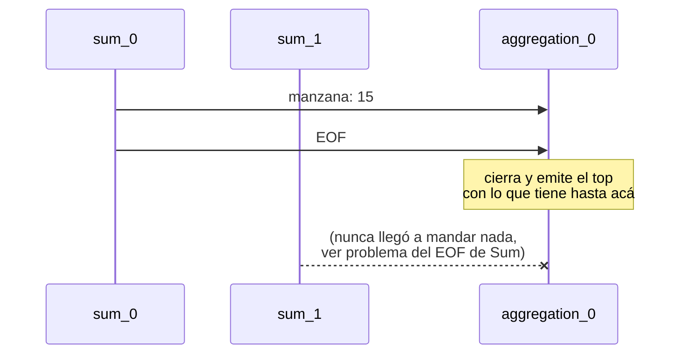
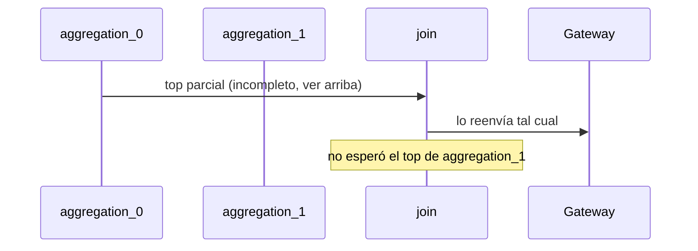
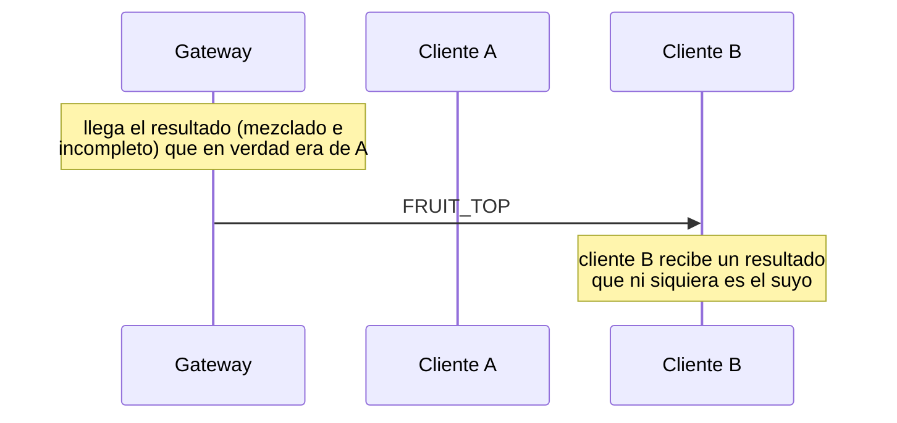

# Informe — TP Coordinación

## Punto de partida

Tras la lectura de la consigna y la revisión del código base, se identificaron una serie de problemas de coordinación. Para que queden trazables de punta a punta se los recorre con un mismo ejemplo guía, con dos clientes concurrentes y dos réplicas de cada control:

- **Cliente A** envía `(manzana, 5)`, `(banana, 3)` y luego EOF.
- **Cliente B** envía `(manzana, 10)`, `(pera, 7)` y luego EOF.
- `SUM_AMOUNT=2` (`sum_0`, `sum_1`) y `AGGREGATION_AMOUNT=2` (`aggregation_0`, `aggregation_1`).

### Middleware sin implementar

`common/middleware/middleware_rabbitmq.py` tenía ambos constructores vacíos (`pass`). No había transporte real entre procesos, así que ninguno de los pasos del ejemplo guía llegaba siquiera a ejecutarse: el sistema no levantaba.

**Solución:** se implementaron ambas clases sobre `pika.BlockingConnection`, con dos formas de comunicación distintas según lo que necesita cada salto de la tubería:

- `MessageMiddlewareQueueRabbitMQ`: una cola durable de trabajo, con consumidores en competencia (round-robin), queremos repartir carga entre réplicas, los datos de `gateway` hacia `sum`.
- `MessageMiddlewareExchangeRabbitMQ`: un exchange de RabbitMQ que se comporta de dos maneras según si se le pasan o no *routing keys*:
  - **Con keys** (tipo `direct`): cada instancia se bindea a su propia clave (p. ej. `aggregation_0`), lo que habilita mandarle un mensaje a una única instancia puntual en vez de a todas.
  - **Sin keys** (tipo `fanout`): cada instancia que se conecta arma su propia cola anónima y exclusiva bindeada al exchange, así que todas reciben una copia de lo publicado sin que el publisher necesite saber cuántas son, esta es la base para resolver "El EOF de un cliente no llegaba a todas las réplicas de Sum", justamente porque el `gateway` no tiene forma de conocer `SUM_AMOUNT`.

### Sin aislamiento por cliente

El protocolo interno serializaba únicamente `(fruta, cantidad)`, sin ningún identificador de cliente. `sum`, `aggregation` y `join` acumulan en una única estructura de estado global (`amount_by_fruit`, `fruit_top`), compartida por todas las conexiones activas.



**Solución:** el protocolo interno (`common/message_protocol/internal.py`) pasó a ser un *envelope* `{client_id, type, payload}` (para `MsgType.DATA` y `MsgType.EOF`), en vez de una lista `(fruta, cantidad)` a secas. El `gateway` genera un `client_id` (`uuid.uuid4()`) por cada conexión aceptada y se lo pasa al `MessageHandler` de esa conexión, que lo mete en todo mensaje que arma. `sum` y `aggregation` dejaron de tener un único estado global: pasaron a `amount_by_fruit_by_client` y `fruit_top_by_client` respectivamente (dict de `client_id` → estado), así que dos clientes concurrentes ya no comparten acumulador, sino que cada uno arma y flushea el suyo de forma independiente, sin pisarse. 

### El EOF de un cliente no llegaba a todas las réplicas de Sum

El `gateway` publicaba el aviso de fin de ingesta en la misma cola de trabajo (`INPUT_QUEUE`) que los datos. Como `sum_0` y `sum_1` son consumidores en competencia de esa cola, ese único mensaje lo recibía sólo uno de los dos; el otro nunca se enteraba de que el cliente había terminado y lo que tenga acumulado para ese cliente no se llegaba a enviar. La constante `SUM_CONTROL_EXCHANGE`, declarada pero no usada en `sum/main.py`, era indicio de que el esqueleto anticipaba un canal de control separado para esto.



**Solución:** el primer intento fue que el `gateway` publique el EOF directo al exchange `fanout` (`SUM_CONTROL_EXCHANGE`), igual que ya hacíamos para los datos con `INPUT_QUEUE`. Al probarlo contra el escenario 3 (`SUM_AMOUNT=3`) rompió, pero no por desorden: los valores venían mal. La causa: el `fanout` no tiene backlog y entrega casi instantáneo a las 3 réplicas, mientras que `INPUT_QUEUE` sí tiene uno real (300 registros, 3 consumidores con `prefetch=1`). El EOF le termina ganando la carrera al grueso de los datos, no sólo al último mensaje.



La solución final invierte el orden: el EOF vuelve a viajar por `INPUT_QUEUE` (misma conexión que los datos de ese cliente, preservando FIFO), y **sólo la réplica de Sum que lo desencola** (una sola, al ser cola en competencia) lo reenvía al exchange `fanout`. Ahora ninguna réplica flushea directo al leer el EOF de `INPUT_QUEUE`: todas, incluida la que reenvía, disparan su propio flush recién al recibirlo por el canal de control. Por FIFO de una única cola, para cuando ese EOF llega a la cabeza y se despacha, los registros de ese cliente que estaban delante ya fueron como mínimo despachados a alguna réplica.

De paso, este cambio destapó una violación de *thread-safety*: usar el mismo exchange de control tanto para consumir (`control_thread`) como para publicar el *relay* (`data_thread`) comparte un canal de `pika.BlockingConnection` entre hilos, que no lo soporta. Se resolvió con dos instancias separadas (`control_exchange` para consumir, `control_exchange_relay` para publicar), cada una con su propia conexión.

### Sin partición de datos entre réplicas de Aggregation

En `sum/main.py`, `_process_eof` reenviaba cada fruta a **todas** las instancias de Aggregation (loop anidado sobre `data_output_exchanges`), en lugar de a una sola. Esto multiplicaba por `AGGREGATION_AMOUNT` tanto el tráfico entre controles como el cómputo, porque cada Aggregation vuelvía a sumar y ordenar datos que ya había procesado la otra, violando el requisito de minimizar redundancia.



**Solución:** `sum/main.py` calcula un hash determinístico de la fruta (`hashlib.md5`, no el `hash()` nativo de Python ya que ese está *seedeado* al azar por proceso, así que dos réplicas de Sum podrían mandar la misma fruta a exchanges distintos) módulo `AGGREGATION_AMOUNT`, y manda cada fruta **sólo** al exchange de esa instancia puntual. El broadcast de EOF hacia Aggregation no se tocó, sigue siendo intencional (todas necesitan enterarse de que esta réplica de Sum terminó).

### Sin barrera de fin de ingesta en Aggregation

`aggregation/main.py` calculaba y emitía su top parcial apenas recibía el primer mensaje de EOF, sin contar que, con `SUM_AMOUNT` instancias de Sum enviándole datos, tendría que haber recibido un EOF de cada una antes de saber que ya tiene el total definitivo de sus frutas.



**Solución:** `aggregation/main.py` cuenta `eofs_received` por cliente y sólo calcula y emite el top cuando llega a `SUM_AMOUNT`. Pero esto expuso otro bug heredado del esqueleto: como ahora una misma fruta puede llegar en más de un mensaje (un total parcial por cada réplica de Sum que la tenía), `_process_data` reasignaba el monto actualizado en el mismo índice de la lista ordenada (`fruit_top[i] = ...`) sin volver a ordenar. Con una sola réplica de Sum esto nunca pasaba, porque Aggregation recibía cada fruta una única vez, ya sumada.

`fruit_top` se mantiene siempre ordenada ascendente por cantidad (por `FruitItem.__lt__`). Con `fruit_top = [banana:5, pera:20, manzana:30]`, si llega `("banana", 50)` de otra réplica de Sum, el código original hacía `fruit_top[0] = banana:55`, dejando la lista `[banana:55, pera:20, manzana:30]`, desordenada (banana ya no es la más chica, pero se quedó en el índice del que sí lo era). `_process_eof` toma `fruit_top[-TOP_SIZE:]` asumiendo orden ascendente, así que con `TOP_SIZE=2` tomaría `[pera:20, manzana:30]`, dejando afuera a banana, que en realidad pasó a ser la mayor.

El fix saca el elemento viejo y deja que `bisect.insort` (búsqueda binaria sobre una lista ya ordenada) encuentre su posición correcta, en vez de reasignar en el lugar:

```
fruit_top:                      [banana:5, pera:20, manzana:30]
del fruit_top[0]:                [pera:20, manzana:30]
bisect.insort(..., banana:55):   [pera:20, manzana:30, banana:55]
```

Ahora `fruit_top[-2:]` sí toma correctamente `[manzana:30, banana:55]` — el top real.

### Sin combinación real en Join

`join/main.py` era un *passthrough*: reenviaba cada mensaje recibido tal cual, sin esperar los `AGGREGATION_AMOUNT` EOFs de las instancias de Aggregation ni combinar sus tops parciales en un top final.



**Solución:** a diferencia de Sum→Aggregation, acá `aggregation/main.py` nunca manda un EOF aparte, ya que cada instancia manda un único mensaje `DATA` con su top parcial cuando cierra su propia barrera de `SUM_AMOUNT`. Así que la barrera de Join no cuenta EOFs, cuenta cuántos tops parciales recibió por cliente: junta los candidatos de cada uno en una lista ordenada, y recién al recibir el `AGGREGATION_AMOUNT`-ésimo arma el top final (los últimos `TOP_SIZE` de esa lista) y lo manda al `gateway`.

Como el particionado por hash de Sum garantiza que una fruta nunca aparece en el top parcial de más de una instancia de Aggregation, acá alcanza con `bisect.insort` liso y llano a diferencia de `_process_data` en Aggregation, nunca hace falta buscar y reemplazar una fruta repetida. 

### El gateway no podía enrutar resultados a su cliente de origen

`message_handler.py` no tenía ninguna noción de a qué cliente pertenecía un mensaje de resultado; simplemente lo ofrecía al primer cliente conectado que no descartara el mensaje.



**Solución:** `MessageHandler` ahora guarda el `client_id` de su conexión (recibido al construirse) y `deserialize_result_message` sólo devuelve el payload si el `client_id` del mensaje coincide con el propio; si no, devuelve `None` para que el loop de `handle_client_response` siga probando con el resto de los clientes conectados. Esto reemplaza el "se lo doy al primero que no tire error" por un enrutamiento real por identidad.

Validado junto con el ítem anterior contra el escenario 2: cada uno de los tres clientes recibe únicamente su propio resultado.

### Sin manejo de señales en los controles internos

`sum`, `aggregation` y `join` no capturaban SIGTERM (sólo lo hacían `client` y `gateway`). Si en medio de esta corrida se ejecutaba `make down`, `sum_1` —que todavía tenía `(banana, 3)` de A sin flushear— era terminado abruptamente al vencer el plazo de gracia, sin poder cerrar la conexión al middleware de forma ordenada.

**Solución:** los tres registran un manejador de `SIGTERM` (mismo patrón que ya usaban `client` y `gateway`) que llama a `stop_consuming()` sobre su(s) cola(s)/exchange(s) de entrada; una vez que `start_consuming()` retorna, cierran sus conexiones y el proceso termina con código 0.

`sum` es el caso particular: corre dos hilos (cola de datos + exchange de control), y Python siempre entrega las señales al hilo principal (que no es el que está bloqueado en ninguno de los dos `start_consuming()`). Esto expuso que `stop_consuming()` en el middleware no era seguro de invocar desde otro hilo: llamaba a `channel.stop_consuming()` directo, y `pika.BlockingConnection` no tolera que otro hilo toque su canal. Se corrigió una sola vez en `middleware_rabbitmq.py`, usando `channel.connection.add_callback_threadsafe(channel.stop_consuming)`, que agenda la detención en el hilo dueño de esa conexión en lugar de tocarla directamente.

## Resumen final

### Clientes

Cada conexión de cliente obtiene un `client_id` propio (`uuid.uuid4()`, generado en el `gateway`) que viaja pegado a todo mensaje interno. Gracias a eso, ningún control necesita un cliente "activo" a la vez: `sum`, `aggregation` y `join` guardan su estado en diccionarios indexados por `client_id` (`amount_by_fruit_by_client`, `state_by_client`), así que atienden a tantos clientes concurrentes como lleguen, cada uno con su propio acumulador aislado, sin coordinación adicional entre ellos ni necesidad de sumar controles para admitir más clientes. El único límite es el de memoria/CPU disponible en cada réplica. Del lado del `gateway`, cada conexión corre en su propio proceso (`multiprocessing.Pool`), así que un cliente lento o caído no bloquea a los demás.

### Volumen de datos de un mismo cliente

Dentro del flujo de un único cliente, el trabajo se reparte en dos puntos:

- **Gateway → Sum**: `INPUT_QUEUE` es una cola de trabajo con consumidores en competencia — cuantas más réplicas de `sum` (`SUM_AMOUNT`) haya configuradas, más se reparte el volumen de `FRUIT_RECORD` de ese cliente entre ellas.
- **Sum → Aggregation**: el particionado por hash de fruta reparte tanto el tráfico como el cómputo de ordenamiento/top-K entre las `AGGREGATION_AMOUNT` instancias — al ser un hash (`md5`) y no depender del contenido semántico de las frutas, la distribución de carga entre instancias es pareja independientemente de qué frutas predominen en el dataset.
